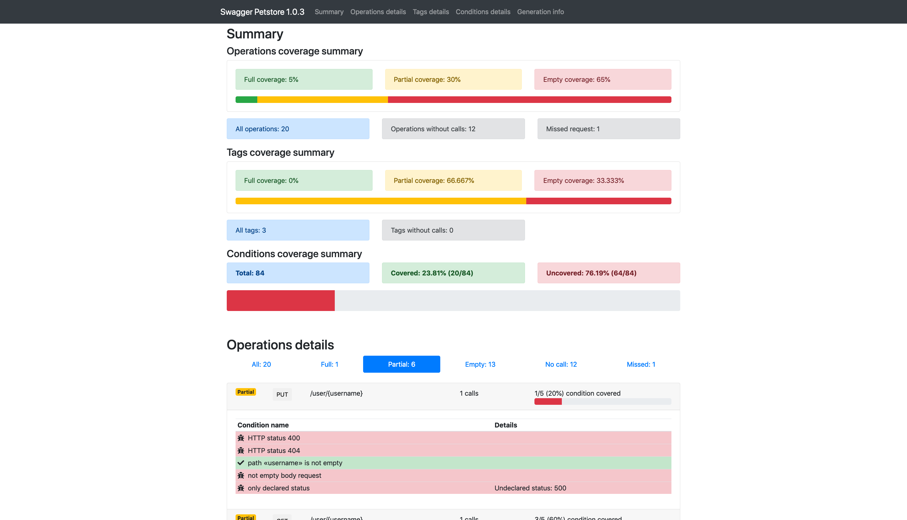

[license]: http://www.apache.org/licenses/LICENSE-2.0 "Apache License 2.0"
[](https://github.com/viclovsky/swagger-coverage/actions)
[  ](https://bintray.com/viclovsky/maven/swagger-coverage/_latestVersion)

# swagger-coverage
Swagger-coverage gives a full picture about coverage of API tests (regression) based on OAS 2 (Swagger). 
By saying coverage we mean not a broad theme functionality, but presence (or absence) of calls defined by API methods, parameters and return codes which corresponds specification of API.



## How it works
Producing coverage report consists of two parts. Firstly, during test execution, filter/interceptor save information of calls in swagger format in specific folder on executing tests.
The next stage is to compare saved result with current API specification and builds report.  

## How to use and examples
* Add dependencies and filter to your test client
Add repository to pom.xml
```xml
 <repositories>
        <repository>
            <id>viclovsky</id>
            <url>https://dl.bintray.com/viclovsky/maven/</url>
        </repository>
 </repositories>
```

Add filter dependency:
```xml
 <dependency>
     <groupId>com.github.viclovsky.swagger.coverage</groupId>
     <artifactId>swagger-coverage-rest-assured</artifactId>
     <version>${latest-swagger-coverage-version}</version>
 </dependency>
```
or if use gradle, it can be added like
```
repositories {
    maven { url 'https://dl.bintray.com/viclovsky/maven' }
}
```

```
compile "com.github.viclovsky.swagger.coverage:swagger-coverage-rest-assured:$latest-swagger-coverage-version"
```

Just add filter into test client SwaggerCoverageRestAssured. For instance, as presented below:
```java
RestAssured.given().filter(new SwaggerCoverageRestAssured())
```

* Download and run command line.
Download zip archive and unpack it 
```
wget https://dl.bintray.com/viclovsky/maven/com/github/viclovsky/swagger/coverage/swagger-coverage-commandline/{latest-swagger-coverage-version}/swagger-coverage-commandline-{latest-swagger-coverage-version}.zip
unzip swagger-coverage-commandline-{latest-swagger-coverage-version}.zip
```

Here is help of unzip swagger-commandline

```
./swagger-coverage-commandline --help

  Options:
  * -s, --spec
      Path to swagger specification.
  * -i, --input
      Path to folder with generated files with coverage.
    --outputSwagger
      Return swagger specification which represents uncoveraged items.
      Default: false
    --ignoreHeaders
      Ignored header names separated by comma.
    --ignoreNotOkStatusCodes
      Ignore all status codes not equal 200.
      Default: false
    --help
      Print commandline help.
    -q, --quiet
      Switch on the quiet mode.
      Default: false
    -v, --verbose
      Switch on the verbose mode.
      Default: false
```

To compare result of API tests with current API specification and build report call command line tool after running tests like that:

```
./swagger-coverage-commandline -s swagger.json -i swagger-coverage-output --ignoreHeaders X-Request-Id,X-Some-Header --ignoreNotOkStatusCodes
```

Output of the command:
```
19:21:21 INFO  OperationSwaggerCoverageCalculator - Empty coverage:
...
19:21:21 INFO  OperationSwaggerCoverageCalculator - Partial coverage (status code or parameter absent):
...
19:21:21 INFO  OperationSwaggerCoverageCalculator - Full coverage:
...
19:21:21 INFO  OperationSwaggerCoverageCalculator - Empty coverage 49.284 %
19:21:21 INFO  OperationSwaggerCoverageCalculator - Partial coverage 12.034 %
19:21:21 INFO  OperationSwaggerCoverageCalculator - Full coverage 38.682 %
19:21:21 INFO  FileSystemResultsWriter - Write html report in file '.../swagger-coverage-report.html'
```
Results (swagger-coverage-report.html/swagger-coverage-results.json) will be created after running of swagger-coverage.

## Important remark
Swagger-coverage works fine with clients which were generated from swagger (for example: https://github.com/OpenAPITools/openapi-generator). 
Because all methods/parameters which will be saved are 100% compatible with current API specification. 

## Output formats
For a moment it is available such output formats:
* Default output in html format: list of fully covered http methods, partially covered and not covered at all.
* Json swagger format with all methods etc. which isn’t covered. It is possible to build html from swagger json for visualisation.  

## Requirements 
For a moment swagger-coverage  is compatible only with OpenApi specification v2. It is possible that swagger-coverage will support other versions.

## License
Swagger coverage is released under version 2.0 of the [Apache License](http://www.apache.org/licenses/LICENSE-2.0)
